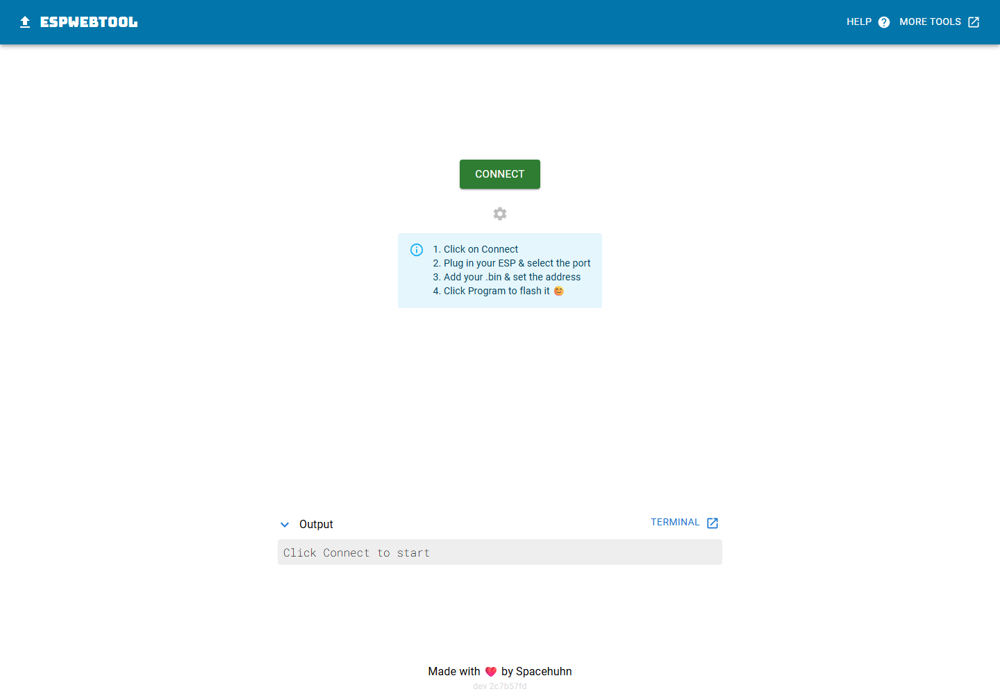

# Yuri's Notes

This fork is compatible with both the ESP32 and ESP8266.

Because the ESP8266 has some idiosyncrasies with its hardware serial ports, I used SoftwareSerial to implement the ESP8266 bridge.  It is limited to ~115200 baud and will likely prove less reliable than an ESP32. `BLUETOOTH` (hardware limitation) and `PROTOCOL_UDP` (software limitation) are not available on the ESP8266.

As is, the sketch will compile, build, and upload without errors for the ESP32.  Edit `config.h` to configure and build for ESP8266.

There are many configurable parameters in `config.h`. Edit to suit your needs - inline comments should provide clarity.

## Major update, Apr 2023:
* Fixed compatibility with Arduino framework 2.0
* Added compatibility with PlatformIO.
* Implemented `PROTOCOL_UDP` (UDP broadcast)
* `PROTOCOL_TCP` and `PROTOCOL_UDP` can be used simultaneously, though doing so may result in serial traffic conflicts if your client connections are not managed carefully.
* Added `ESP32-Serial-WiFi-Client.ino` in a separate sketch folder to make an ESP32 TCP or UDP client that connects to the ESP-Serial-Bridge. Edit `client_config.h` and upload to a second board.
* Multiple bugs (possible buffer overruns) are fixed in the latest commit(s).
* Latest commits also include some styling/readability edits, though I can easily admit that it isn't the "prettiest" of C++ projects.

# ESP32-Serial-Bridge

## Prebuilt release

The current ESP32 DevKit build is available as a single, complete flash image in
[`releases/v2.0-esp32-b808213`](releases/v2.0-esp32-b808213). It is derived from
source revision `b808213ef88063a63280170b72387edf6b119964` and is intended for a
standard 4 MB ESP32 Dev Module.

### Flash with ESPWebTool

Use Chrome or Edge and a USB data cable. The browser must support Web Serial.

1. Plug the ESP32 into the computer and open
   [ESPWebTool](https://esptool.spacehuhn.com/).
2. Click the green **CONNECT** button.
3. Allow serial-device access if the browser asks for permission. In the port
   chooser, select the ESP32's USB-to-UART port. On Windows this will usually be
   named **Silicon Labs CP210x USB to UART Bridge (COMx)** for a CP2102/CP2102B
   board. The COM number will vary. If no CP210x port appears, install the
   [Silicon Labs CP210x VCP driver](https://www.silabs.com/software-and-tools/usb-to-uart-bridge-vcp-drivers)
   and check that the USB cable supports data.
4. Select the port, then try these connection methods in order. Return to step
   2 before each retry:
   - **Method 1 - automatic reset:** Do not press either board button; click
     **Connect** in the browser's port chooser. This worked on the CP210x ESP32
     used to verify this release.
   - **Method 2 - hold BOOT:** Hold **BOOT**, click **Connect**, and keep holding
     **BOOT** until ESPWebTool either connects or reports an error. Then release
     it.
   - **Method 3 - manual bootloader reset:** Hold **BOOT**, press and release
     **EN/RESET**, and click **Connect** while continuing to hold **BOOT**.
     Release **BOOT** when ESPWebTool connects or reports an error. Do not hold
     **EN/RESET** by itself; the ESP32 cannot communicate while reset is held.
     This is the sequence described in Espressif's
     [manual bootloader guidance](https://docs.espressif.com/projects/esptool/en/latest/esp32/advanced-topics/boot-mode-selection.html#manual-bootloader).
5. After ESPWebTool connects, add only
   `ESP-Serial-Bridge-v2.0-esp32-b808213.bin`, set its address to exactly `0x0`,
   and click **Program**. Wait for flashing to finish before unplugging the
   board.

The `.bin` file is a single complete image containing the bootloader, partition
table, OTA boot data, and application. Do not add the individual build files or
use any address other than `0x0`.

The release is an immutable snapshot of the current build configuration. Its
Wi-Fi/AP settings are intentionally retained from `config.h`: this is a
single-device bridge configuration, not a multi-device deployment. Run only
one such bridge in the same local setup at a time, because every flashed unit
uses the same AP identity and static address (`192.168.4.1`).

Connect to the bridge access point with:

| Setting | Value |
| --- | --- |
| SSID | `3301` |
| Password | `33013401` |

Transparent WiFi (TCP) to all three UART Bridge, supports both AP and STATION WiFi modes. The .ino file is the code for the ESP32. Use Arduino IDE for ESP32 to compile and upload it to the ESP32.
I made this project in order to connect Flight equipment devices devices like (Radio, Vario FLARM), to a Flight Computer (Kobo, Smartphones etc.),  but it is not limited to that. You can use it wherever you want, but on your own risk. Read license file for more details.                                  

===============================================================

Used Libraries: (must be installed in the arduino IDE):

https://github.com/espressif/arduino-esp32

===============================================================

In some cases the memorylayout is to small for this scetch.
If you face this problem you can either disable Bluetooth by removing
#define BLUETOOTH
in config.h 
or change the partition size as described here:
https://desire.giesecke.tk/index.php/2018/04/20/change-partition-size-arduino-ide/

Arduino hardware configuration:

https://github.com/AlphaLima/ESP32-Serial-Bridge/blob/master/Settings.jpg

===============================================================

example usecases:

https://www.youtube.com/watch?v=K2Hia06IMtk

https://www.youtube.com/watch?v=GoSxlQvuAhg

# Hardware
here is the wiring diagram recomendation:

Pinning                                                                                     
COM0 Rx <-> GPIO21                                                                               
COM0 Tx <-> GPIO01                                                                                 
COM1 Rx <-> GPIO16                                                                               
COM1 Tx <-> GPIO17                                                                              
COM2 Rx <-> GPIO15                                                                               
COM2 Tx <-> GPIO04                                                                              

NOTE: The PIN assignment has changed and may not look straigt forward (other PINs are marke as Rx/Tx), but this assignment allows to flash via USB also with hooked MAX3232 serial drivers.

I recomend to start your project with a Node32s or compatible evaluation board. For a TTL to RS232 level conversion search google for "TTL RS3232 Converter"

https://tech.scargill.net/wp-content/uploads/2017/05/ESP326.jpg

